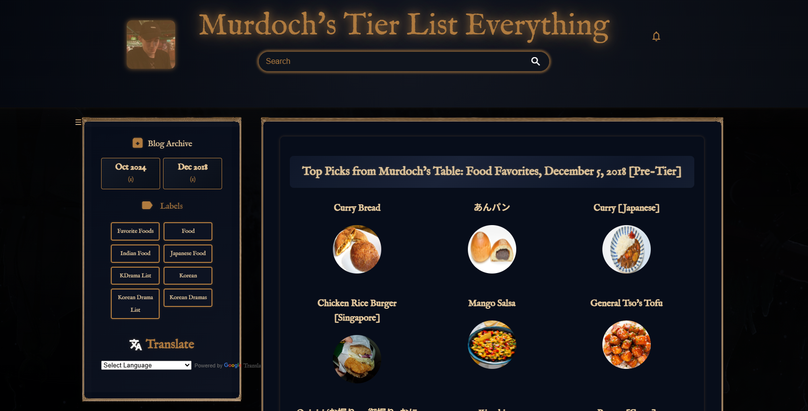

# Murdoch's Tier List Everything — Blogger Theme

A custom **Blogger theme** for [Murdoch's Tier List Everything](https://murdochstierlisteverything.blogspot.com/) — one of Murdoch Harris' autological projects, where he attempts to categorize as much of the universe as possible into tier lists.

This theme is designed for clarity, elegance, and obsessive categorization — blending a dark neon-cyber aesthetic with retro literary typography to reflect the recursive spirit of ranking everything, including the act of ranking itself.

---

## ✨ Features

- Dark theme with glowing bronze and cyan highlights  
- Responsive grid layout for categories and post previews  
- Custom-styled archive, label, and translate widgets  
- Classic *IM Fell English* typeface for an old-school print vibe  
- Pure HTML + CSS — fast, minimalist, and JavaScript-free

---

## 🚀 How to Use

1. Open your [Blogger dashboard](https://www.blogger.com/)
2. Go to **Theme** → **Edit HTML**
3. Replace the entire code with the theme contents from this repository
4. Save and personalize as you see fit

> 💡 **Backup your old theme** before making changes.

---

## 🌐 Live Preview

🔗 Visit the live blog:  
[murdochstierlisteverything.blogspot.com](https://murdochstierlisteverything.blogspot.com/)

---

## 📄 License

**MIT License** — free to copy, adapt, and remix. Attribution is appreciated but not required.

---

## 🧠 About the Project

**Murdoch’s Tier List Everything** is an autological experiment in meta-categorization — a blog that tier-lists not just things, but the idea of tier-listing itself. The theme follows suit: expressive, functional, and recursive by nature.
